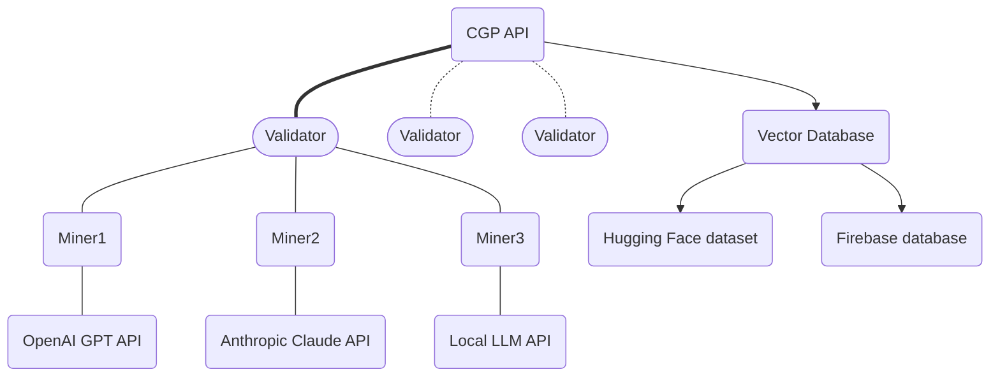
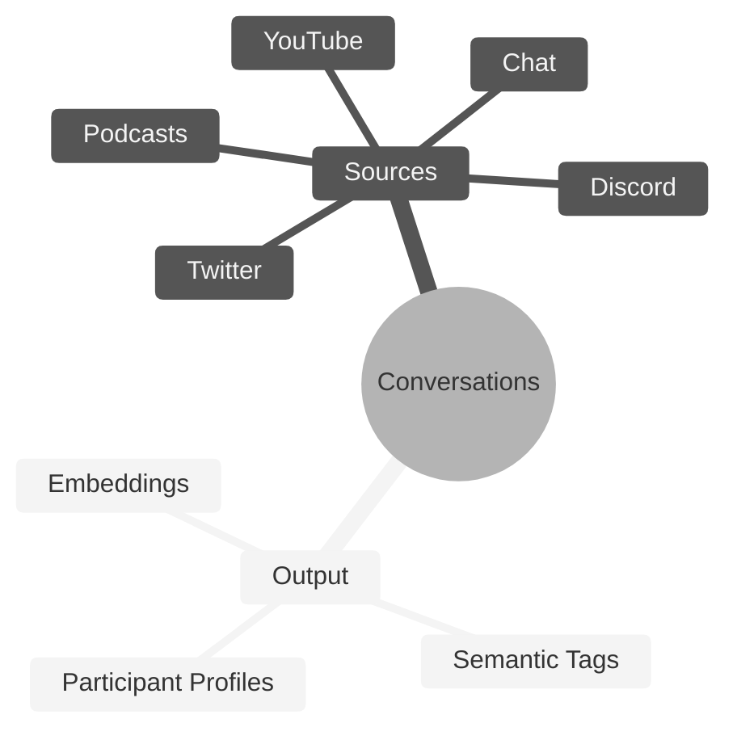

# **Conversation Genome Project** <!-- omit in toc -->
[](https://discord.gg/bittensor)
[](https://opensource.org/licenses/MIT)

---
- [Conversation Genome Project](#conversation-genome-project)
  - [Key Features](#key-features)
- [Getting Started]
  - Quickstart Local run
  - Quickstart Testnet run
  - Quickstart Main run
- [Conversation Genome Project Overview]
  - [Benefits](#benefits)
  - [System Design](#system-design)
  - [Rewards and Incentives](#rewards-and-incentives)
- [Setup](#setup)
- [Mining](#mining)
- [Validating](#validating)
- [License](#license)

---

# Introduction to the Conversation Genome Project

The Conversation Genome Project (CGP) is an open-source initiative aimed at enabling personalized conversational AI by providing a comprehensive dataset of indexed and tagged conversations.

If you are new to Bittensor, please checkout the [Bittensor Website](https://bittensor.com/) before proceeding to the setup section.



## Key Features

- Indexing and tagging of billions of conversations across various sources (YouTube, podcasts, etc.)
- Leveraging fractal data mining and conversation windows for efficient processing
- Synthetic participant profiles generated from conversation metadata
- Boring Index algorithm to assess conversation quality (relevance, engagement, novelty, coherence, and fluency)
- Open-source dataset for training and fine-tuning conversational AI models
- Incentivized mining and validation system for data contribution and integrity


# Quickstart Mock Tests

The best way to begin to understand the Conversation Genome (CG) is to run the unit tests. These tests are meant to provide verbose output so you can see how the process works. They also execute against mock data sources and APIs so you don't need to have anything set up in terms of keys, etc. to see how this operatates.

Clone the repo and install the requirements:

```console
git clone https://github.com/afterpartyai/bittensor-afterparty-conversation-genome-subnet.git ap-cg-subnet
cd ap-cg-subnet
pip install -r requirements.txt
```

Once this is setup, let's run the Miner, so you can watch the process at work:

```console
python -m unittest discover tests_ap testminer
```

You can follow the output to see the miner executes the following flow:

* Receive a conversation from the validator
* Process the conversation which will generate 3 main sets of data about the conversation:
** Participant Profiles of each participant in the conversation
** Semantic tags for different aspects of the conversation
** Vector embeddings of the semantic tags
* Return the processed data to the validator

The data generated is explained in detail in the Overview section below. The output should look something like this:

```
Mined 37 tags
......
----------------------------------------------------------------------
Ran 6 tests in 0.002s

OK
```

Let's run the validator tests which will make get a conversation, send the conversation to the miner, and validate the response.

```console
python -m unittest discover tests_ap testvalidator
```

The output will show the following execution flow:

* Establish a connection to the (mock) Conversation Server (CS)
* Download a (mock) conversation to process
* Send the conversation to a group of miners (3 in this test)
* Receive the processed responses
* Send each response to the CS and receive scopes for the tags and profile
* Divide the reward based on those scores
* Send for emissions

The output should look something like this:

```
Found 37 tags
Validating 37 tags
.............
----------------------------------------------------------------------
Ran 13 tests in 0.002s
OK
```

# Quickstart Configuration and API Tests

Now that you've seen the process execute, let's configure your instance and run the tests that verify everything is setup properly.

First duplicate the dotenv file:

```console
cp example.env .env
```

Use your editor to add your settings. You will need a ChatGPT key and a Bittensor hotkey. If you're on a Linux box, the nano editor is usually the easiest:

```console
nano .env
```

Once this is configured, run the config tester that will do a baseline test to make sure all of the proper variables are set:

```console
python -m unittest discover tests_ap testvalidator
```


If you have any reported errors in the .env and run again until all tests are finished. Now run the process tests. These will run outside the Bittensor network (so no emissions), but they will get a test conversation, process it using your OpenAI key, and report the results. That will make sure the process itself is running properly on your machine.

```console
python -m unittest discover tests_ap processtest
```

If everything is working properly, you are ready to run against the testnet. Simply run this file:

```console
bash run_testnet.sh
```

When you're ready to register and run on mainnet, use this file:

```console
bash run_mainnet.sh
```

# Conversation Genome Project Overview

Conversation Genome Project (CGP) use the Bittensor infrastructure the refine data related to conversations.

## Benefits

- Addresses the lack of personalization in current conversational AI models
- Enables natural and engaging conversations tailored to individual contexts and preferences
- Provides a comprehensive and annotated dataset for conversational AI development
- Encourages open-source community contributions and advancements
- Maintains data integrity through validation and scoring mechanisms

## System Design

- Data stores: Primary source of truth, conversation windows, participant profiles, and vector database
- Validator roles: Pull data, ground conversations, create windows, and score submissions
- Miner roles: Process conversation windows, provide metadata and tags
- Data flow: Ground truth establishment, window creation, miner submissions, scoring, and validation

## Rewards and Incentives

- Miners rewarded for accurate and valuable metadata contributions
- Bell curve distribution of rewards to encourage high-quality submissions
- Cross-referencing and vector space analysis to ensure data integrity
- Boring Index algorithm for assessing conversation quality (not yet used for miner rewards)


## Mining

You can launch your miners via pm2 using the following command.

`pm2 start ./miner/miner.py --interpreter python3 -- --netuid 18 --subtensor.network <LOCAL/FINNEY/TEST> --wallet.name <WALLET NAME> --wallet.hotkey <HOTKEY NAME> --axon.port <PORT>`


## Validating

You can launch your validator via pm2 using the following command.

`pm2 start ./validators/validator.py --interpreter python3 -- --netuid 18 --subtensor.network <LOCAL/FINNEY/TEST> --wallet.name <WALLET NAME> --wallet.hotkey <HOTKEY NAME>`




 The above copyright notice and this permission notice shall be included in all copies or substantial portions of
# the Software.

# THE SOFTWARE IS PROVIDED “AS IS”, WITHOUT WARRANTY OF ANY KIND, EXPRESS OR IMPLIED, INCLUDING BUT NOT LIMITED TO
# THE WARRANTIES OF MERCHANTABILITY, FITNESS FOR A PARTICULAR PURPOSE AND NONINFRINGEMENT. IN NO EVENT SHALL
# THE AUTHORS OR COPYRIGHT HOLDERS BE LIABLE FOR ANY CLAIM, DAMAGES OR OTHER LIABILITY, WHETHER IN AN ACTION
# OF CONTRACT, TORT OR OTHERWISE, ARISING FROM, OUT OF OR IN CONNECTION WITH THE SOFTWARE OR THE USE OR OTHER
# DEALINGS IN THE SOFTWARE.
```
